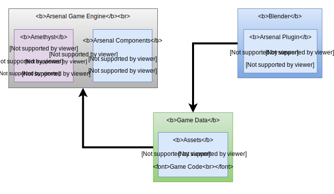

# Architecture Draft 2

Arsenal will provide what is necessary to achieve a full Blender integration with the [Amethyst](https://github.com/amethyst/amethyst) game engine. Extra, more opinionated components may be added on top of Amethyst if deemed necessary to provide the particular user experience that we are targeting with Arsenal, but the goal of Arsenal will be to build as much on top of Amethyst as possible, with contributions being made to Amethyst to help facilitate Arsenal's goals.

## Components

### Blender Plugin

The Arsenal Blender plugin will be made up of two components: the Python plugin, and the Rust Python extension. The Python plugin uses Blender's Python API to provide the UI elements specific to Arsenal inside of Blender while using the Rust Python extension to do the heavy lifting required for asset exporting.

The line between the Blender plugin and the Python extension is not fully decided at this point. The Rust extension should be used, at least, to do any processing intensive operations and will allow us to multi-thread things like asset conversion and scene export. The Python plugin may be sufficient for most other tasks if it is not decided that it is preferable to write those components in Rust due to things like Rust's static typing.

The Blender integration should orchestrate everything necessary to develop your game and build it for release. It is possible that CLIs may alternatively be used for tasks like building and distribution.

### Amethyst

Amethyst and its ecosystem will provide all of the core components of the game engine.

#### Rendering

We will be using Amethyst's [Rendy](https://github.com/amethyst/rendy) rendering library. If the render that Amethyst comes with on top of Rendy is sufficient for our taste we may not need to implement anything extra from a rendering standpoint. If necessary, though, we can write our own, more targeted, renderer on top of Rendy.

#### Scripting

Establishing Amethyst's scripting ability will be essential to Arsenal. There is currently an [RFC](https://github.com/amethyst/rfcs/blob/master/0001-scripting.md) for scripting in Amethyst and establishing that in the engine will be necessary for Arsenal. Arsenal will then make it easy to create and use scripts in the supported languages, from Blender ( though script editing will not be done in Blender ).

#### Blender Components and Systems

In order to support a Blender-compatible scene graph, we will add the components and systems necessary to handle Blender objects in the game during runtime. These components will be built into the version of Amethyst distributed with Arsenal.

## Distribution

Arsenal will be distributed as a Blender addon and, ideally, will be usable with no additional setup, other than putting the addon in the Blender addons directory. The addon should be self-contained with all of the tools required to use the engine.

From a scripting standpoint, if you want to script with Rust or other compiled languages, we may require that you install those tools separately, but support for Lua scripting and Logic Nodes should come out-of-the box so you can get started right-away.
