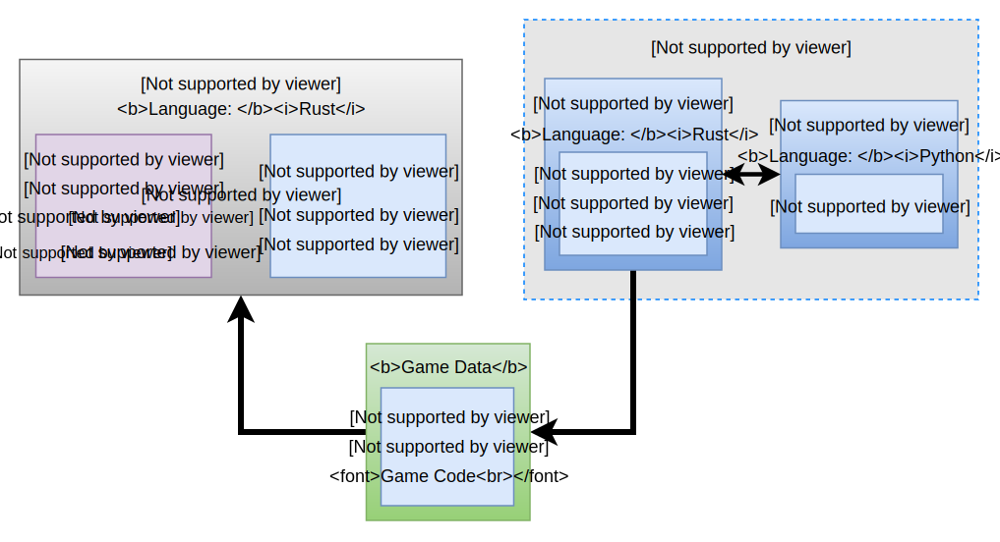

# Architecture

At a high level, Arsenal is composed of three main components: **Arsenal Core**, **Arsenal Runtime**, and **Arsenal Blender**.

## Arsenal Core and Arsenal Blender

Arsenal Core and Arsenal Blender both combine to make up the Arsenal Blender plugin. Together they define Arsenal's presence inside of Blender. Arsenal Core is written in Rust and Arsenal Blender is written in Python. They both serve different goals:

* **Arsenal Core** provides high performance core functionality to the Arsenal Blender plugin such as scene export and live game sync.
* **Arsenal Blender** provides the Blender UI elements and uses Arsenal Core to carry out actions triggered by the game developer.

## Arsenal Runtime

### Amethyst

### Arsenal Components

