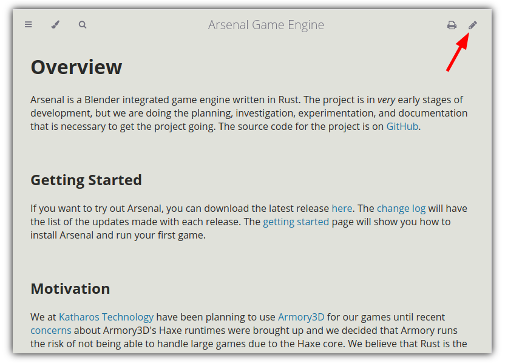
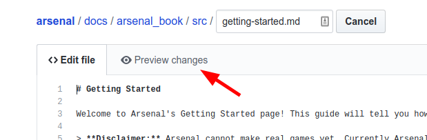
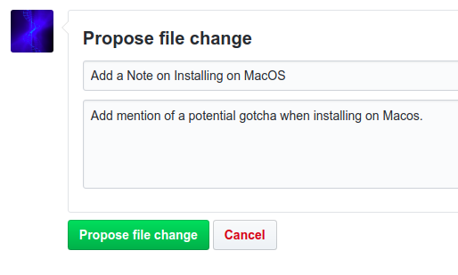
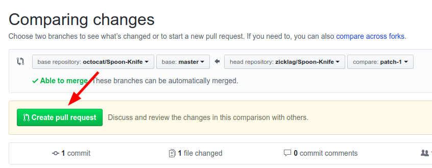

# Documentation

The documentation for Arsenal is on this site and built with an Open Source tool called [mdBook](https://github.com/rust-lang-nursery/mdBook). There are two different ways you can contribute to the documentation: with the [GitHub online editor](#using-github), or by [setting up a local sandbox](#using-a-local-sandbox) on your computer.

## Using GitHub

If you don't want to install any extra tools on your computer, it is easy to contribute to the documentation though the GitHub web interface. To edit a page just click the pencil icon at the top right of any page in the docs:



This will bring you to the GitHub editor for that page. You can make your edit and preview your changes with the preview button.



Once you are done, you can propose your changes. Please give your contribution a short tile and optionally a description.



After submitting that form, it will bring you to a page that summarizes the changes that you made. From there click "Create Pull Request".



Finally, you can fill out any extra information that you want us to have and, once you submit it, we will review your changes and either merge them or comment on what we would like changed.


That's it! 🎉

## Using a Local Sandbox

Before you can make changes in your local sandbox, you have to create it! See the [Using Git](../using-git.md) guide to learn how get your sandbox setup and how to make changes and contribute them. Once you understand how that works, you can start making changes.

All of the documentation for Arsenal is written in [Markdown], a simple markup language. The documentation can be found in the [`docs/arsenal_book/src`][arsenal_docs] directory. You can edit those files with your favorite text editor. If you just want to make simple changes, then that could be all that you need, but if you want to get a live preview of what your changes will look like on the actual site, then you can install [mdBook][mdbook].

[Markdown]: https://guides.github.com/features/mastering-markdown/
[arsenal_docs]: https://github.com/katharostech/arsenal/tree/master/docs/arsenal_book/src
[mdbook]: https://github.com/rust-lang-nursery/mdBook

### Installing mdBook

[mdBook][mdbook] is the tool that we use to convert our markdown documentation to a nice looking documentation website. You can read the [mdBook Documentation][mdbook_docs] if you want to understand more about how it works. For now, though, go ahead and download and install the latest [release][mdbook_release] of mdBook.

[mdbook_docs]: https://rust-lang-nursery.github.io/mdBook/
[mdbook_release]: https://github.com/rust-lang-nursery/mdBook/releases

### Serving the Site Locally

Once mdBook is installed, to view the site locally, open a terminal in the `docs/arsenal_book` directory and run:

```bash
$ mdbook serve -o
2019-07-19 19:43:20 [INFO] (mdbook::book): Book building has started
2019-07-19 19:43:20 [INFO] (mdbook::book): Running the html backend
2019-07-19 19:43:20 [INFO] (mdbook::cmd::serve): Serving on: http://localhost:3000
2019-07-19 19:43:20 [INFO] (ws): Listening for new connections on 127.0.0.1:3001.
2019-07-19 19:43:20 [INFO] (mdbook::cmd::watch): Listening for changes...
2019-07-19 19:43:24 [INFO] (ws::io): Accepted a new tcp connection from 127.0.0.1:48088.
```

mdBook will build the site and open it in your web browser. Additionally, mdBook will watch the docs for changes and update the site automatically.
