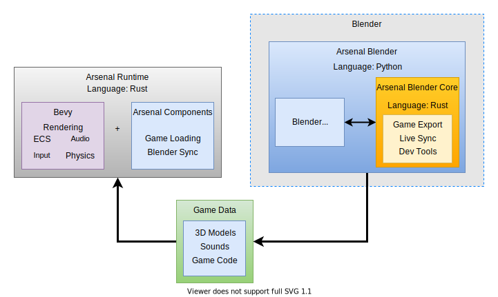

# Architecture

At a high level, Arsenal is composed of three main components, all of which are located in the root of the Arsenal git repository: **Arsenal Blender**, **Arsenal Blender Core**, and **Arsenal Runtime**.

## Arsenal Blender

[Arsenal Blender][arsenal_blender] is the top level of the Arsenal Blender plugin. Arsenal Blender contains all of the Python code that creates the Arsenal UI elements and operators inside of Blender. Arsenal Blender is the "glue" that binds the **Arsenal Blender Core** and the **Arsenal Runtime** to the Blender interface. If you want to work on our Blender user-experience, this is the place to start.

[arsenal_blender]: https://github.com/katharostech/arsenal/tree/master/arsenal_blender

## Arsenal Blender Core

The [Arsenal Blender Core][arsenal_blender_core] is the portion of the Blender plugin that is written in Rust and that handles most of the heavy lifting in the Blender plugin. Arsenal Blender uses the Arsenal Blender Core to do the more process intensive tasks and it will use it to communicate with your Arsenal game while it is running to provide features like hot reload and live sync.

The goal of the Arsenal Blender Core is to provide the highest possible performance and to remove any limits on what the Arsenal Blender plugin can do. Because it is written in Rust instead of Python, the Arsenal Blender Core can accomplish things like multi-threading and communicating with native system libraries when necessary.

The Arsenal Blender Core is implemented as a native Python module and, even though it is written in Rust, it is imported by Arsenal Blender just like any other Python module would be. Because the Arsenal Blender Core is imported by Arsenal Blender, both components run fully inside of the Blender process.

### Game Data

When you run an Arsenal game, your Blender file and all of the Logic Nodes and other code get exported to a `build_[projectname]` directory adjacent to the Blend. The Arsenal Blender Core is responsible for doing the export. The exported data is then loaded and run inside the Arsenal Runtime.

[arsenal_blender_core]: https://github.com/katharostech/arsenal/tree/master/arsenal_blender_core

## Arsenal Runtime

The [Arsenal Runtime][arsenal_runtime] is what is responsible for actually running the game data that is exported from Blender. This runs completely **outside** of Blender. This is important for licensing reasons, because you can not commercially market a game that has any Blender code in it. Arsenal games, despite being *developed* in Blender, will have no Blender code in the game.

The Arsenal Runtime is written in Rust and combines great tools from the Rust gamedev community. The core of the Arsenal runtime is built on top of the [Bevy] game engine.

[Bevy]: https://bevyengine.org
[arsenal_runtime]: https://github.com/katharostech/arsenal/tree/master/arsenal_runtime

### Bevy

[Bevy] will pull al lot of the weight in the Arsenal runtime and provides windowing, audio, an ECS, a Renderer, an input system, and other components foundational to a running game. Bevy takes care of a lot of the difficult aspects of designing a game engine for us and allows us to focus on our Blender user experience and integration.

Bevy is also very modular in design which allows us to add or replace components as we need without locking us into a particular design.

### Arsenal Components

In addition to Bevy, we will also be developing components that are specific to Arsenal. This will include things like live Blender sync and other features, many of which will still be built on top of other Bevy components. These will also be bundled into the Arsenal Runtime.
