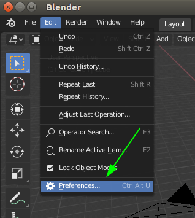
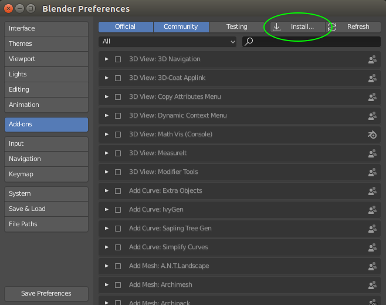
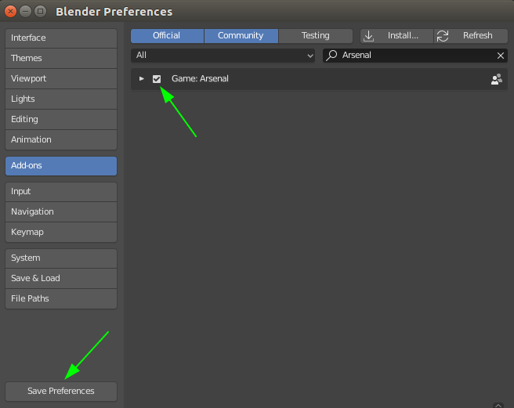
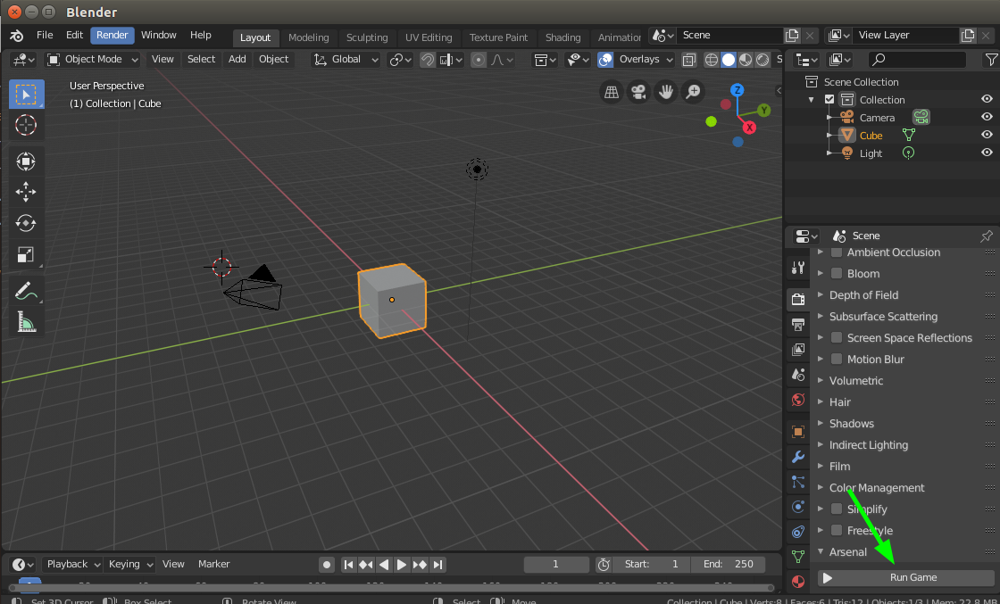
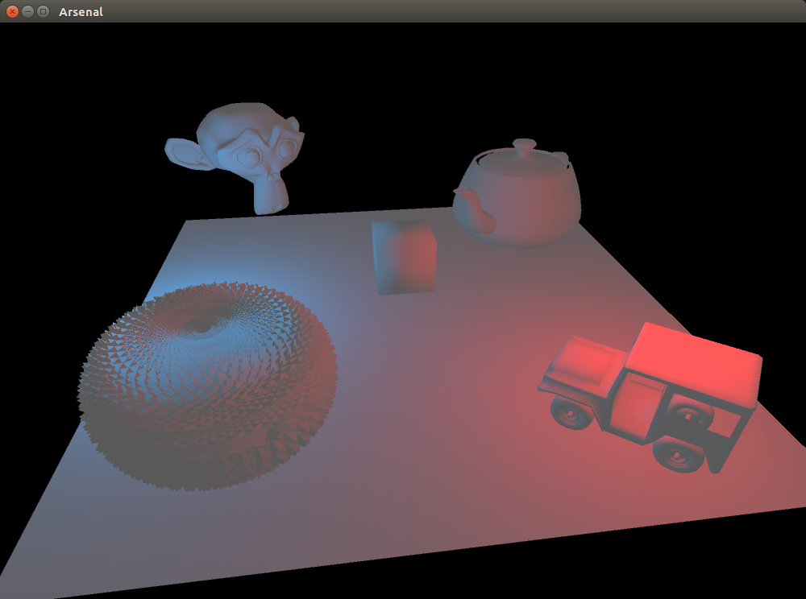

# Getting Started

Welcome to Arsenal's Getting Started page! This guide will tell you how to install Arsenal and run your first "game".

> **Disclaimer:** Arsenal cannot make real games yet. Currently Arsenal can export your Blender scene to a game with colorless models, static lights, and an orbit camera. That's it. Still, this represents a big step in the direction of allowing you to make games inside of Blender, so if you are still interested, lets get started!

## Installing

Arsenal is made up of a completely self-contained Blender plugin. Before you can use it you must install [Blender 2.80 Beta](https://builder.blender.org/download/). After installing Blender you can download the latest version of Arsenal from [GitHub](https://github.com/katharostech/arsenal/releases). We have builds of Arsenal for 64bit Windows, Mac, and Linux platforms.

Once you have downloaded Arsenal, start up Blender and open the user preferences.

In the Blender preferences go to the Add-ons tab and click Install.

Navigate to the arsenal zip file that you downloaded earlier and double-click it. This will add Arsenal to the Blender add-on list. Click the check box next to the add-on name to enable the add-on and then click "Save Preferences".

> **Note:** Some versions of Blender will not have the "Save Preferences" button. In that case the preferences will be automatically saved.

You can close the preferences dialog and that's it! Now all we have to do is run a game.

## Running a Game

Now that we have Arsenal installed, go ahead and save the blend. You can't run an Arsenal game if the blend has not been saved yet. After the blend is saved, we can run it! We just have to click the "Run Game" button in the "Arsenal" panel of the "Render" tab.

Here is the result:

Arsenal will export the scene with the basic cube in it and it will run a game that allows you to view your scene by moving the mouse to orbit the camera around the world center. You can hit the escape button to exit the game.

Congratulations you ran your first Arsenal game! It isn't much yet, but it's a start.

So far there are a couple things to note about the game:

* Arsenal added two lights to the scene: a blue light and a red light. Arsenal doesn't yet export the lights from the Blender scene. That will be fixed in a later release
* Arsenal only exports objects smooth shaded so the cube looks kind of non cube-like. This will also be fixed later.

Now that we've got it running, lets mess around with our scene a bit more. Go ahead and add whatever objects you want to the scene and click "Run Game" again. Arsenal will re-export the scene and run the game with your new updates.

## Summary

That concludes our tutorial and shows you everything that Arsenal can do so far. The next thing that we will be working on is getting scripting support so that you can start to make the game do stuff.

If you had any trouble getting through the tutorial or if you have any questions, you can open up a [GitHub issue](https://github.com/katharostech/arsenal/issues) and we'll try to get it fixed. If you like what we are doing and you think that Arsenal is cool, give us a star on [GitHub](https://github.com/katharostech/arsenal)!
