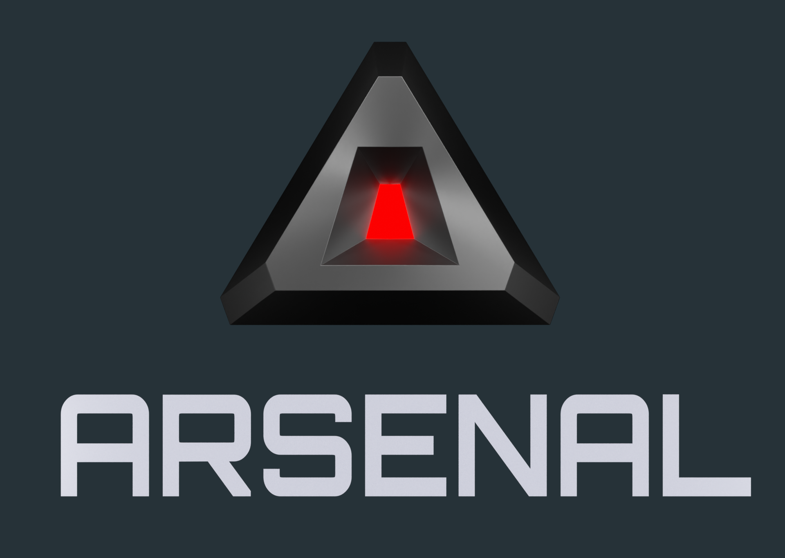

# Arsenal

[gh]: https://github.com/katharostech/arsenal

## The Vision

Arsenal is a Blender game engine written in Rust and developed by [Katharos Technology][Katharostech.com]. With Arsenal we want to create an Open Source game engine that will bring the ability to make games of any scale, to users of any experience level. Arsenal will combine the powerful user interface of [Blender] with a high performance game engine core written in [Rust].

Friendly user-experience and beginner accessibility will be important on the list of features for Arsenal, but all of that ease of use must not come at the disadvantage of performance: Arsenal should be able to produce games of any size or complexity.

To program your games, Arsenal will incorporate scripting languages such as Python, in addition to being able to use logic nodes inside of Blender for a graphical programming experience. And if you want, you will always be able to write Rust to get the maximum performance.

Arsenal is our dream for the ultimate game engine, but there is a lot of work that needs to be done. By [sponsoring us][sponsor] on GitHub you help bring that dream to reality. You can learn more about the [vision of Arsenal][vision] or check out the [FAQ]. We also posting any updates on Arsenal development in the [Arsenal category][category] of our website.

[Blender]: https://blender.org
[Rust]: https://rust-lang.org
[sponsor]: https://github.com/sponsors/katharostech
[FAQ]: ./FAQ.md
[docs]: https://katharostech.github.io/arsenal/index.html
[vision]: ./vision.md
[category]: https://katharostech.com/tag/arsenal

## Proof of Concept

We have [downloads] of our first Arsenal proof-of-concept for 64bit Windows, Mac, and Linux, and a [Getting Started][started] guide that will walk you through testing it out. This is just the proof-of concept, though, and you cannot yet make real games with it.

[arsenal_feed]: https://katharostech.com/tag/arsenal
[Katharostech.com]: https://katharostech.com
[downloads]: https://github.com/katharostech/arsenal/releases
[started]: ./getting-started.md

### Design & Architecture

The current design plan is to build Arsenal as a Blender plugin that uses the [Bevy] game engine at its core. The [architecture] documentation explains the components in more detail.

[Bevy]: https://bevyengine.org/
[architecture]: ./development-guide/architecture.md

## Bugs, Feature Requests, and Questions

We use [Taiga] for issue tracking. If you have any feature requests, bug reports, or questions you can submit an issue on our [Arsenal Taiga project][project].

[Taiga]: https://taiga.io/
[project]: https://tree.taiga.io/project/zicklag-arsenal/issues
[wiki]: https://tree.taiga.io/project/zicklag-arsenal/wiki/home
