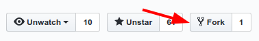
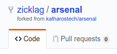
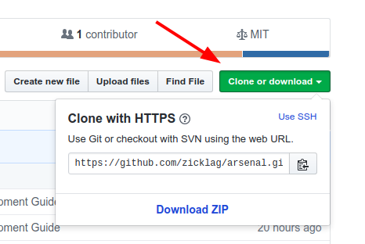

# Creating a Sandbox

Once you have Git installed, you can download or **clone** your own copy of the Arsenal project to your computer. The first step to that is to **fork** the Arsenal GitHub repository.

## Forking Arsenal

A fork on GitHub is like your own personal copy of somebody else's GitHub repository. In your own fork, you can make any sort of changes that you want, without having to get approval or worry about ruining somebody else's work. Once you are happy with the changes that you have made in your fork, you can create a **pull request** to the original repository and ask that you changes get included in the official repo.

You can create a fork on GitHub by clicking the fork icon in the top right corner of the GitHub repository home page.



GitHub will take a second to fork the repo before presenting you with your own copy of the Arsenal project! You can tell that it is a fork because it will have your name in the upper-left hand and a note that it was forked from `katharostech/arsenal`.



Now that you have a fork, you can **clone** it to your computer.

## Cloning Your Fork

In order to test and make changes to your fork, you need to clone it to your computer. Cloning is a Git term that means to copy the repo to a local machine with all of the included Git history. When you clone a repo, it doesn't just give you the current state of the repo, but the entire history of the repo since it was created. It also keeps track of what is necessary to get the latest changes to the repo when things are updated.

On the homepage of your fork, there will be a green button that says "Clone or Download". Click this button and copy the URL inside to your clipboard.



Now you have to find a place that you want to put the repo on your system. Probably in a "git" folder somewhere. Once you have that, you have to open up your Git terminal in that directory. On Windows, the Git terminal, or Git Bash, would have been installed when you installed Git and you can open it by right-clicking on a folder and selecting "Open with Git Bash".

Inside of the terminal paste the following, replacing the URL with the URL that you copied from your fork.

```bash
git clone https://github.com/zicklag/arsenal.git
```

This will clone the repo to a directory named "arsenal" wherever you opened the terminal. You can now browse the whole Arsenal repo on your computer.

## Adding the Arsenal Remote

Now that you have cloned your fork, you need to tell Git about the official Arsenal repo so that you can get updates when we make changes.

In your terminal, we will change directory to the newly cloned repository and then add a new **remote** called "arsenal" and set it to the official Arsenal repo:

```bash
cd arsenal
git remote add arsenal https://github.com/katharostech/arsenal.git
```

Now that git knows about our official Arsenal repo, you can update your local sandbox with the latest changes from GitHub by running:

```bash
$ git pull arsenal master
From https://github.com/katharostech/arsenal
 * branch            master     -> FETCH_HEAD
Current branch my-changes is up to date.
```

> **Note:** Don't type the `$` sign. Lines that start with a `$` represent lines that you are supposed to type. Lines without a `$` indicate lines that were output by git.
