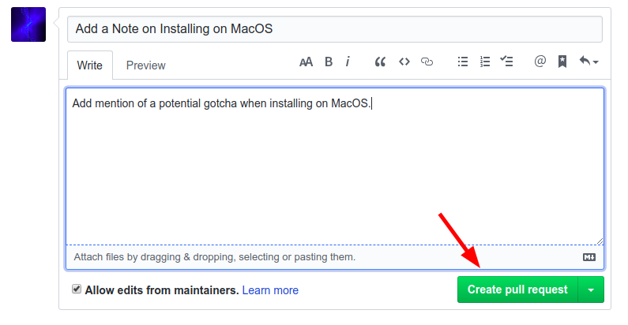

# Making Changes

## Creating a Branch

When making changes to a Git repository, you usually do your changes in what is called a Git **branch**. A branch is like a stream in which you can make changes in your Git repo without effecting other branches. This allows you to work on multiple things at the same time, without getting different separate changes mixed up with each-other. For each change that you will want to submit to Arsenal, you should create a branch to do it in.

First open your Git terminal in the Arsenal git repository. If you type `git status` in the terminal and hit enter, it will tell you that you are on the branch "master" and that there is nothing to commit:

```bash
$ git status
On branch master
Your branch is up-to-date with 'origin/master'.
nothing to commit, working directory clean
```

This means that you are on the branch master and there have been no changes.

Now we are going to create a new branch to make some changes in:

```bash
$ git branch my-changes
$ git checkout my-changes
On branch my-changes
nothing to commit, working directory clean
```

First we run `git branch my-changes` which creates a new branch called `my-changes`, then we run `git checkout my-changes` to switch our current branch to the new branch that we just created. Git then tells us that we have created a new branch and that there are no changes.

You can switch back and forth between branches whenever you want by running `git checkout branch-name`.

## Making a Change

Now that we have a branch to work in, its time to make some changes! Go ahead and change some files. Maybe you could [contribute to the documentation](../contributing/documentation.md). Once you have made some changes, we can see what has happened by running `git status`:

```bash
$ git status
On branch my-changes
Changes not staged for commit:
  (use "git add <file>..." to update what will be committed)
  (use "git checkout -- <file>..." to discard changes in working directory)

        modified:   docs/arsenal_book/src/FAQ.md

no changes added to commit (use "git add" and/or "git commit -a")
```

Git tells us that a file has been changed. Before git will "save" the change, though, we have to **commit** the change. Before we can commit the change we need to **add** the changes that we want to commit.

```bash
$ git add .
$ git commit -m 'Add an FAQ'
[my-changes d777617] Add an FAQ
 1 file changed, 4 insertions(+)
```

The reason for a separate `add` step is to allow you to add only the changes that you want to, in case there were multiple changes and you only wanted some of them. When we said `git add .` the `.` meant that we want to add everything in the current directory and any directories in the current directory.

When we say `git commit -m 'Add an FAQ'` the `-m` tells Git to create a commit with the following **message** which we put inside of single quotes. Once that is done, we can see our new commit by doing a `git log`:

```bash
$ git log
commit d777617c3056137e14c5a66546d3f9782f13c031
Author: Zicklag <zicklag@katharostech.com>
Date:   Fri Jul 19 18:21:31 2019 -0500

    Add an FAQ

commit ec8c092a3ff9da84383e486e09ab204846abc4ca
Author: Zicklag <zicklag@katharostech.com>
Date:   Thu Jul 18 22:09:54 2019 -0500

    Add Unreleased Changes to the Changelog

    - Add a development guide to the arsenal book
    - Move arsenal book to the docs/ folder
    - Organize project structure to better separate the modules

commit 8f433b10208b1c68cc42ec745889a78a9acb1641
Author: Zicklag <zicklag@katharostech.com>
Date:   Wed Jul 17 21:04:26 2019 -0500
:
```

You can move up and down through the history with the `k` and `j` keys and you can exit with the `q` key. The log will show our latest commit on top of the stack and all of the other commits in history below it.

## Pushing Your Changes

Now that we have made our change and committed it, we can push it up to our fork on GitHub:

```bash
$ git push origin my-changes
Username for 'https://github.com': zicklag
Password for 'https://zicklag@github.com':
Counting objects: 6, done.
Delta compression using up to 4 threads.
Compressing objects: 100% (5/5), done.
Writing objects: 100% (6/6), 483 bytes | 0 bytes/s, done.
Total 6 (delta 4), reused 0 (delta 0)
remote: Resolving deltas: 100% (4/4), completed with 4 local objects.
remote:
remote: Create a pull request for 'my-changes' on GitHub by visiting:
remote:      https://github.com/zicklag/arsenal/pull/new/my-changes
remote:
To https://github.com/zicklag/arsenal.git
 * [new branch]      my-changes -> my-changes
```

When we run `git push origin my-changes` we are telling Git to push the changes in the current branch to our `origin`, is our fork, where we cloned the repo from. We also have to tell it push to a branch named `my-changes` in our fork. Once that is done, GitHub conveniently gives us a link that we can use to create a **pull request** so that we can get our changes merged into the official Arsenal repo.

## Creating a Pull Request

You can now follow the link that Git provided to create a pull request for your changes.



Here you can add any extra information that might be applicable to your changes, and once you submit the pull request, we will review your changes and either merge them or comment on what we would like changed.

If we request changes, you can make the changes, add and commit them, and push them again just like you already have. This will update your pull request automatically.

Once your changes have been approved, they will be merged into the project and you will be an official contributor!

## Finishing Up

After your pull request has been merged you can checkout the master branch again and pull in the latest changes from the official repo to make sure you are up to date.

```bash
$ git checkout master
Switched to branch 'master'
Your branch is up-to-date with 'origin/master'.
$ git pull arsenal master
From https://github.com/katharostech/arsenal
 * branch            master     -> FETCH_HEAD
Current branch master is up to date.
```

You are now ready to create a new branch and start making more contributions.
